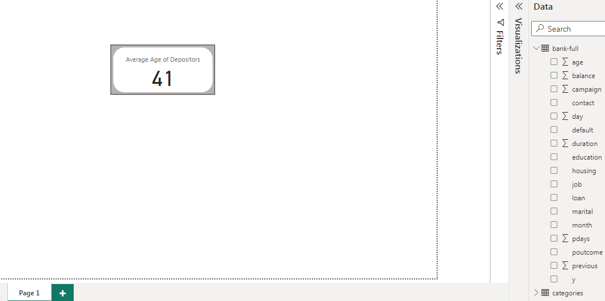
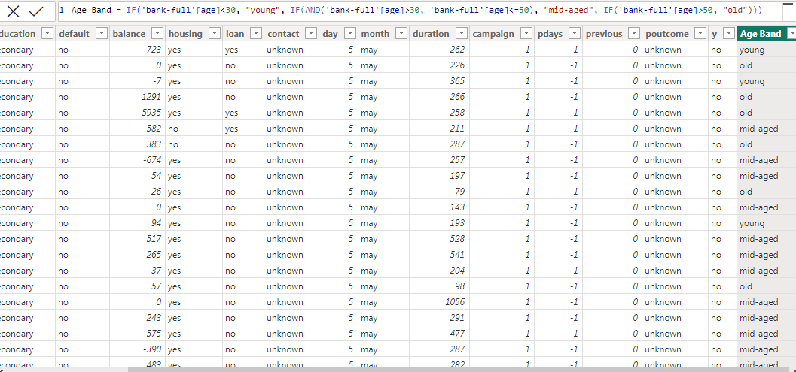

# DAX FUNCTIONS IN POWERBI

# Introduction:

DAX functions in PowerBI are powerful tools for performing calculations and aggregations and they help to derive meaningful insights and metrics from the dataset.
They are also used to gain deeper insights,perform advanced analysis and create customized measures and columns tht suit specific business needs.it also provide the flexibility and functionality necessary for robust data modelling and reporting in PowerBI.

# Problem Statement:

This task requires that 

1. Create a measure for the 'Average age of depositors'

2. Create a new column named 'Age band' containing the following
- 'Young' for ages below 30
- 'Mid Aged' for ages between 30 and 50
-  'Old' for ages above 50

3. Create a measure calculating the total balance for:
- Job:Technician
- Marital:Single and married

4. Create a measure to get the number of depositors on loan

# Result/Discussion:
The Average Age of Depositors is 41 and the snipshot below shows the measure and the DAX function used is,

Average Age of Depositors = CALCULATE(AVERAGE('bank-fll'[age]),FILTER('bank-full','bank-full'[loan]="Yes")).

- --

Below is the snipshot of the new column "Age band" specifying categories based on age ranges and the DAX function used is

Age band = IF('bank-full'[age]<30, "Young", IF('bank-full'[age]<50, "Mid Aged", "Old"))

- --

The snipshot below shows the calculatd total balance for individuals with a job of technician and marital status of "single" or "married"

The function used for the above solution is Total Balance by Job (Technician)= CALCULATE(SUM('BANK-FULL'[balance]),FILTER('bank-full','bank-full'[job]="Technician"))

Total Balance for Married and single is shown in the snipshot below 

- --

The snipshot below shows the calculated number of depositors on loan and the function used is as follows
CALCULATE(COUNT('bank-full'[loan]),FILTER('BANK-FULL','BANK-FULL'[LOAN]= "Yes"))

- --

# Conclusion:

The above analysis gives an insight of the average number of depositors on loan,the total balance of individuals working as technicians and those with marital statuses of single and married,Average age of depositors and Age band.
With these insights,The bank can reach out to other Age brackets,occupation and statuses for their growth.
